# Project instructions

We'll walk you through on some technical questions that might come up when starting a new project from creating your repository to how to work in pairs using the same branch.

## Repository kickoff

All your projects will need to have a repository on Github that you push your work to.

### Working alone

If you're doing the project alone, go ahead and open Github on your browser and create a new repository there. Fill out the following information:

- Repository name: the name of your project
- Set the repository visibility to public

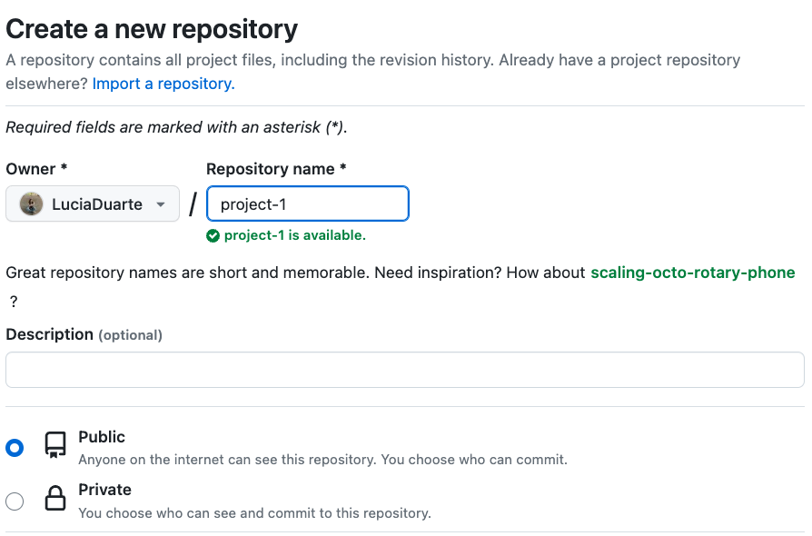

Click on the `Create repository` button.

You'll be directed to the repository you just created and you'll see this `Quick setup` section. Copy the repository link from there.

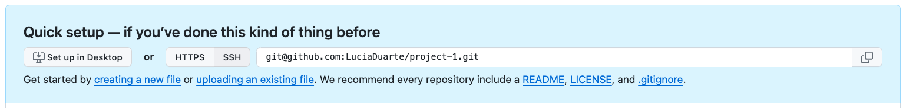

Now open your terminal and navigate to where you want to have your project code. Once there, run:

`git clone <theLinkOfYourRepo>`

You can now enter the folder that was created, open it on VSCode and start adding your code!

### Working in group

If you're working with a group, you'll need to pick one of the group to create the Github repository. That person (_Person1_) will need to follow all the steps in the section **Repository kickoff: Working alone**.

After that is done, it's also necessary to add the rest of the group as a collaborator in the repository. _Person1_ needs to open the project repository in Github, click on the `Settings` tab and on the left, click on the `Collaborators`.

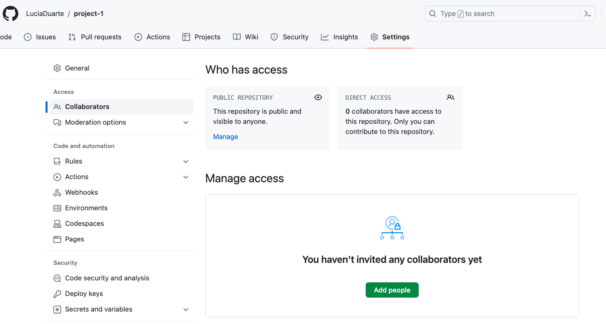

Click on the `Add people` button and add all the other members.

After being added as a collaborator, _Person2_ can go to the repository page, copy the repository link and run on their terminal:

`git clone <theLinkOfYourRepo>`

All the other elements of the group should **not** fork the repository. You'll want to work on the same repository so everyone should create a local copy from the same repo.

## Working routine

### Working alone

Everyday you work on your project you should regularly push your changes to Github. This should be done often, with at least one commit per day. You should try and have commit messages that describe the latest changes you applied.

To push your work, open the local folder on the terminal and run:

`git add .`

`git commit -m "adding the basic html"` <- Here's an example for a commit message

`git push`

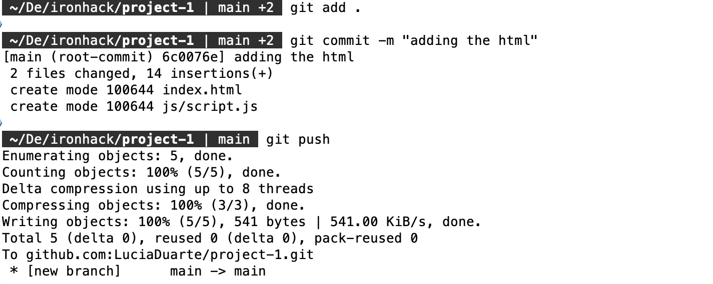

#### Working on multiple computers

If you're working on multiple computers, for instance, you have the laptop you bring to class but also have a desktop at home you like to work on, please follow the instructions on **Working routine: Working in group**.

### Working in group

Let's say this group has two elements: _Person1_ and _Person2_.

The best scenario to work on the same branch is to try to avoid working on the same files. For instance, if _Person1_ is working on the html, _Person2_ should avoid that file and work on the javascript.

Every time any of the elements go to work on the project, the first thing that needs to be done is to `pull` the code that is remotely on Github. Open the project on your terminal and run:

`git pull`

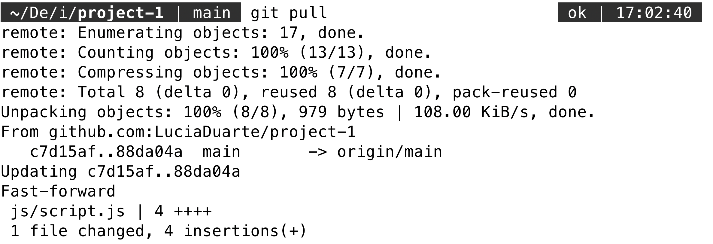

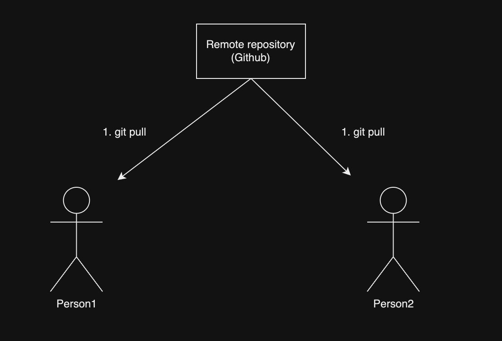

This will make sure any changes that the other members might have done will be reflected on your computer.

Now _Person1_ will add some updates to the code. After those changes, _Person1_ needs to push them.

Now, _Person2_ also made some changes and wants to push them. However, the repository now contains some work that is not yet in _Person2_'s computer so they get this message:

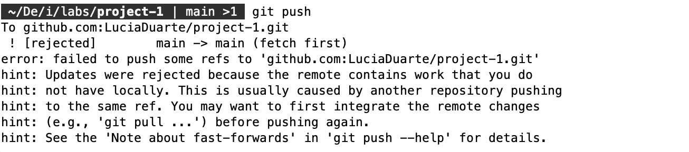

Before being able to push the changes, _Person2_ needs to pull:

`git pull`

When pulling, a few things can happen:

- There is no conflicting work;
- There are divergent branches and there is no merge strategy defined (FAQ#1);
- Git is able to resolve the divergent code by itself and ask for a commit message (FAQ#2);
- There is divergent code and needs to be resolved manually (FAQ#3);

After that, _Person2_ can push their changes and _Person1_ will need to pull those changes in.

## FAQ

1. I tried to `git pull` but got a message saying there are divergent branches.

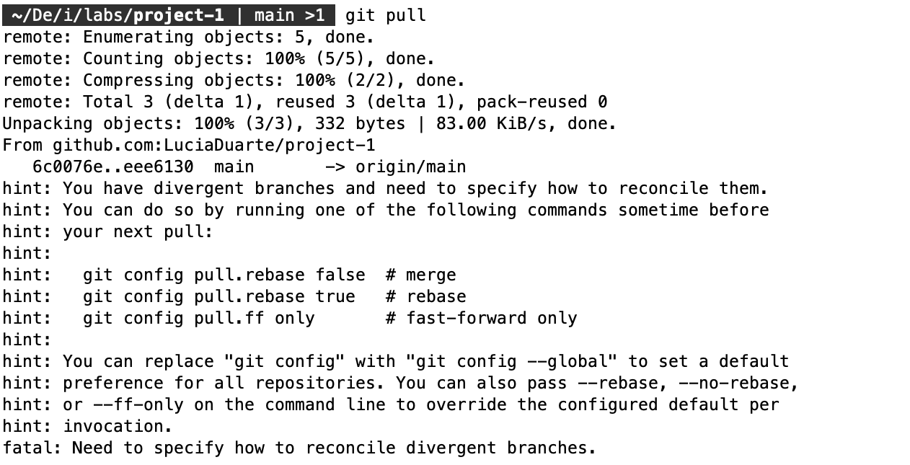

After getting this message, run the first suggestion:
`git config pull.rebase false`

After that, you can pull again.

2. I tried to `git pull` but got a message asking to enter a commit message.

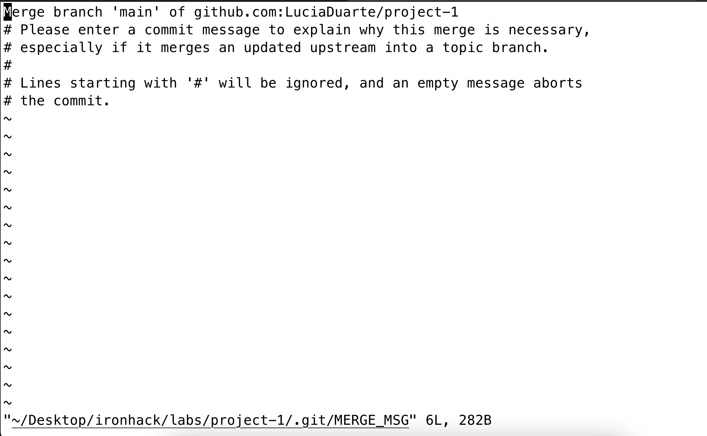

Type `:q` to exit that screen and then you'll be able to push your your. An automatic commit message will be created for that merge.

3. I tried to pull but got a message saying the automatic merge failed and I needed to resolve conflicts
   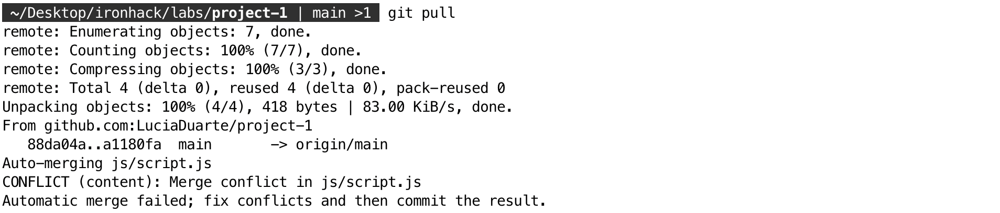

Go to VSCode and you'll be able to see the conflicts and easily fix them. In the Source Control View you can see the list of files with conflicts under `Merge Changes`. You'll need to open them one by one and select which version of the code you want to keep.

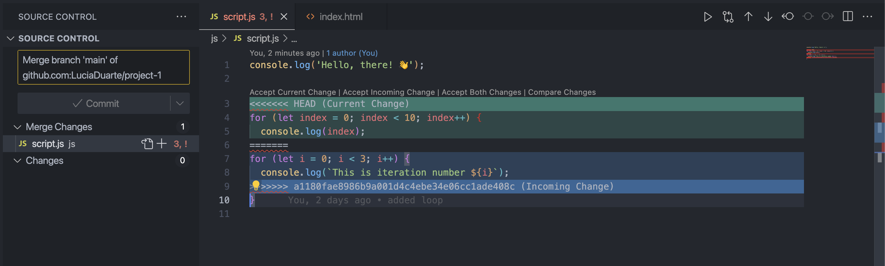
The green will show you your version of the code and the blue will highlight the incoming code. Above the green block there are some buttons to allow you to choose.

- Click on `Accept Current Change` to keep your version of the code;
- `Accept Incoming Change` to keep the code coming from the other elements of the group;
- `Accept Botch Changes` to keep both versions
- `Compare Changes` to see a detailed view of the differences.

After doing this selection for every conflict, you can run:
`git add .`
`git commit -m <yourMessage>`
`git push`
